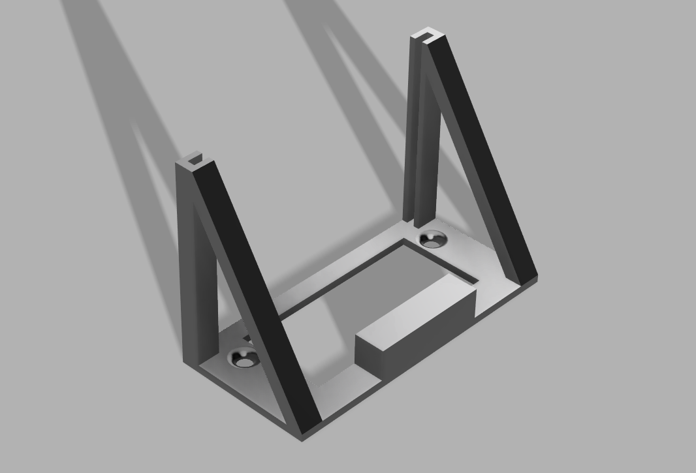
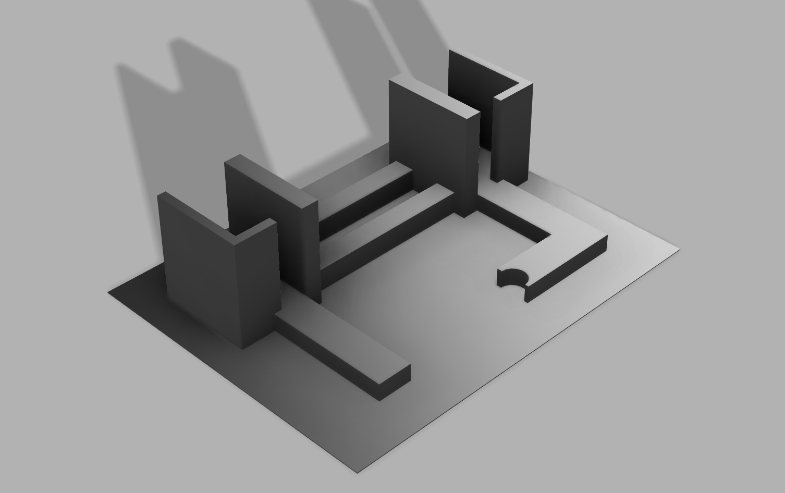
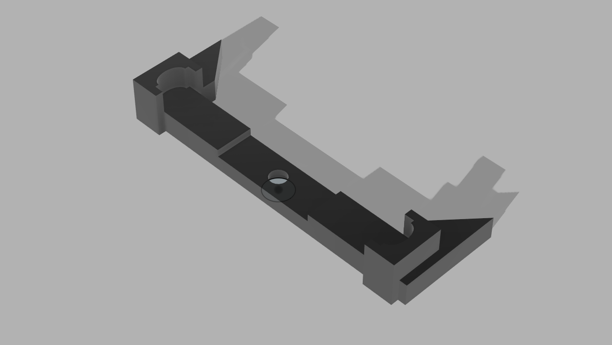
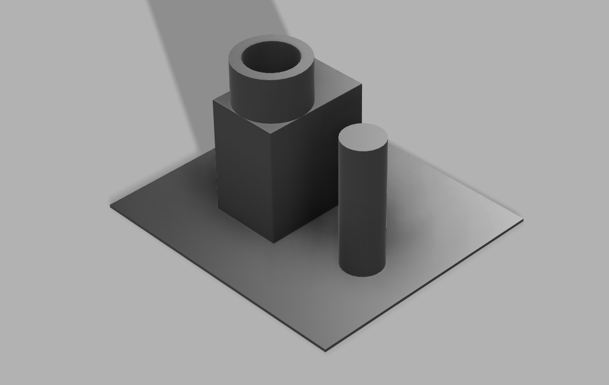

# Automatic Light Switcher using ESP32

<!-- Insert real life Image here -->

This is an ESP32 powered light switcher that can be installed onto common light switch brackets found in North American households. 
Using the two screws as mounting points, it is affixed to the switch and makes use of an SG90 servo motor to flip the switch. 
The system detects an exit / entry using PIRs (Passive Infrared sensor) to try minimize false positives.

Features:
- An ESP32 core to handle processing and power, with the use of the Espressif esp-idf programming library
- Two PIR sensors to detect incoming / outgoing people, and an internal total causing a switch flip when going from 1 to 0 of vice versa
- An SG90 servo motor to phyisically filp the switch up and down.
- Two button inputs for disabling the automatic control and to flip the switch manually
- Custom 3D printed parts for the servo horn and the mounting bracket
- A soldered breadboard design to hold all of the parts including status LED and buttons securely

The system can function in two modes: using either one or both of the PIR sensors. Each has their advantages.
Single sensor: Simpler and more reliable. Will flip the switch whenever a person is detected.
Dual sensor: Better for guests. Will tally the number and only turn the light off when everyone is out. More prone to error due to inherent sensor issues.

The housing for the sensor is designed to be able to rotate 90°, allowing for a more broad application given the differences in light switch installation loactions.
Once at the desired location, I opted to use an adhesive to lock it in place.

Images:

This is the main bracket for mounting. The soldered breadboard can be slid into the side, and the servo can be mounted into the block on the back using an included screw into the part. The holes on the top and bottom are spaced according to North American commercial light switch brackets to allow for simple mounting.

This unit houses the two PIR sensors. The back part is long enough to match the connectors of female wire ends connecting to the pins. The cutout allows for a full 90 degree rotation.

This part is meant to go overtop of the (included) 180 degree servo horn. The included screw is too short, but a different one could reach. Otherwise, the topper must be glued on.

The cylindrical part of this is designed to attach to the PIR sensor housing as a pivot point. It is separated to simplify printing. The recepticle part is to be mounted to the soldered breadboard.
